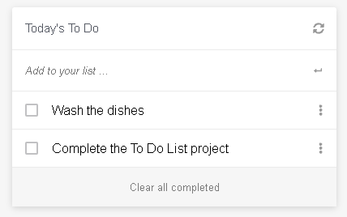

# To Do List

> This project consist in making a To Do task list using webpack.

## Preview



## Built With

- HTML & CSS
- Javascript
- Webpack

## Getting Started

- Run git clone on this project at the desired directory:
   ```
   git clone https://github.com/lfmnovaes/todo-list.git
   ```
- Run `npm install` to install the necessary packages to run locally
- After installing everything, run `npm start` and your default browser will open with the page

### Prerequisites

An updated web browser

### Usage

- Type the task in the text field
- Tick the checkbox to mark the task as completed
- Save modifications to the browser's Local Storage and retrieves modification from it too
- Hit enter to add a new element to the list (Work in progress)
- Click on the checkbox to mark the task as done (Work in progress)
- Click on the bottom button to remove the done tasks from the list (Work in progress)

## Authors

👤 **Luís Fernando**

- GitHub: [](https://github.com/lfmnovaes)
- Twitter: [](https://www.twitter.com/lfmnovaes/)
- LinkedIn: [](https://www.linkedin.com/in/lfmnovaes/)

## 🤝 Contributing

Contributions, issues, and feature requests are welcome!

Feel free to check the [issues page](../../issues/).

## Show your support

Give a ⭐️ if you like this project!

## Acknowledgments

To everyone in Microverse.

## 📝 License

This project is [MIT](./LICENSE) licensed.